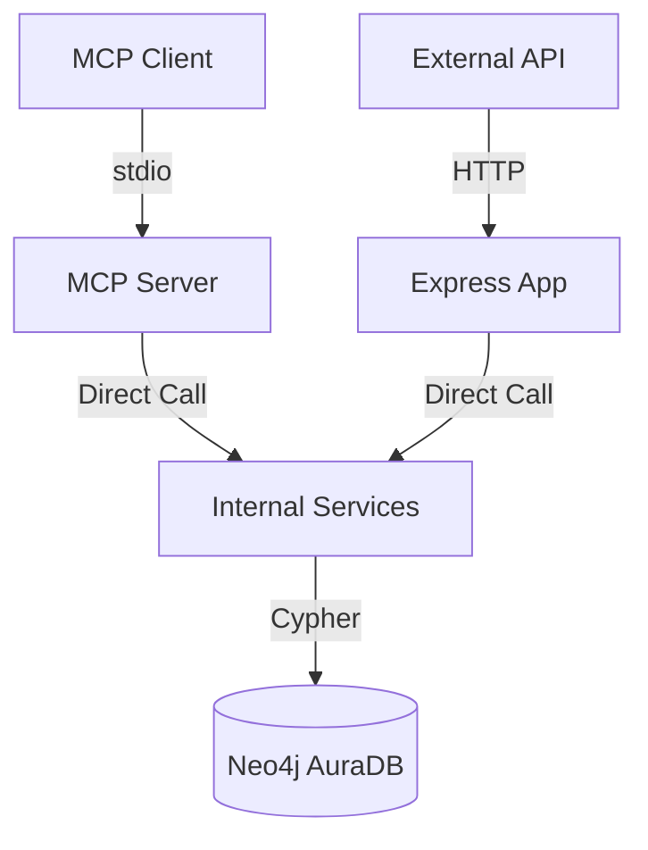

<!--
title: Node Crypto & MCP Infrastructure Rules
description: Industrial standards for Ed25519 reliability, Uint8Array sanitization, and Zero-Network MCP Server architecture.
category: Core Agent Behavior
-->

# Node Crypto & MCP Infrastructure Rules

This document defines the industrial standards for implementing robust cryptographic operations and Model Context
Protocol (MCP) infrastructures within the project. These rules ensure multi-context reliability and eliminate common
failure points in binary data handling and internal communications.

***

## 1. Cryptographic Reliability (Ed25519)

To ensure consistent behavior across different Node.js execution contexts (e.g., `tsx`, `jest`, `webpack`), the project
mandates the use of the built-in Node.js `crypto` module for all Ed25519 operations.

### 1.1 Direct Node.js Crypto Usage

Avoid third-party libraries like `noble-ed25519` for core signing and verification, as they often exhibit
"Uint8Array expected" errors due to prototype mismatches in mixed ESM/CJS or transpiled environments.

- **Mandate**: Use `crypto.sign(undefined, message, privateKey)` and `crypto.verify(undefined, message, publicKey, signature)`.
- **Sanitization**: External binary data MUST be converted using `Uint8Array.from()` to ensure it possesses the correct
    prototype for the current context.

```typescript
// Correct Industrial Pattern
export function sign(message: Uint8Array): Uint8Array {
  // Defensive sanitization for multi-context reliability
  const cleanMessage = Uint8Array.from(message);
  const signature = crypto.sign(undefined, Buffer.from(cleanMessage), privateKeyObject);
  return new Uint8Array(signature);
}
```

***

## 2. MCP Server Architecture (Zero-Network)

To eliminate elusive hangs and "Premature close" errors in internal communication, MCP servers MUST bypass the network
stack for tool execution.

### 2.1 Direct Service Invocation

MCP tools MUST invoke backend services directly (In-Process) rather than making internal HTTP requests to their own
underlying API.

- **Eliminate Internal HTTP**: Do NOT use `http`, `axios`, or even `supertest` for internal MCP-to-API calls.
- **Service SSOT**: Initialize Service classes once at startup and pass them the same database drivers used by the
    Express application.
- **Bypass Middleware**: Internal tool calls bypass the Express middleware stack (e.g., auth, rate-limit), reducing
    latency and technical risk.



***

## 3. Industrial Testing Protocols

Testing MCP servers requires validation across multiple layers: from raw JSON-RPC to interactive visual tools.

### 3.1 JSON-RPC Integrity (Pipe Testing)

The primary validation for MCP infrastructure is pipelining raw JSON-RPC requests via `stdin` and capturing `stdout`.

```bash
# Industrial Pipe Test
echo '{"jsonrpc": "2.0", "id": 1, "method": "tools/call", "params": {"name": "tool_name", "arguments": {...}}}' | npx tsx src/mcp/server.ts
```

### 3.2 Curl-Based Service Validation

Before testing the MCP transport, validate the underlying service logic in isolation.

- **Service Unit Tests**: Test Service logic without the MCP or Express wrapper.
- **Endpoint Smoke Tests**: Use `curl` to verify that the standard HTTP API behaves as expected, ensuring the database
    and environmental configurations are correct.

### 3.3 MCP Inspector Protocol

Use the `@modelcontextprotocol/inspector` for interactive verification.

- **Command**: `npx -y @modelcontextprotocol/inspector <startup_command>`
- **Telemetry**: Direct all console logs to `stderr` to avoid polluting the JSON-RPC stream on `stdout`.

### 3.4 Docker environment Validation

When verifying in containerized or CI/CD environments:

- **Volume Mapping**: Ensure signing keys and database certificates are correctly mounted.
- **DNS Resolution**: Use host-mapped IPs (e.g., `127.0.0.1`) instead of `localhost` to avoid IPv6/IPv4 resolution
    ambiguity in certain Node.js versions.

***

## 4. Neo4j AuraDB Safety Standards

AuraDB Free introduces specific constraints for driver initialization and query complexity.

- **URI Inheritance**: Always use `neo4j+s://` for encrypted cloud connections.
- **Configuration SSOT**: Do NOT mix explicit `encrypted: true` flags with `neo4j+s://` URIs, as this triggers
    driver-level configuration errors.
- **Query Optimization**: Avoid unindexed `shortestPath` queries on large graphs; always anchor pathfinding with
    specific Node IDs or indexed attributes.

***

## 5. Related Conversations & Traceability

- **[2026-02-15] MoltBridge Integration Debugging**: Resolved `Uint8Array` prototype mismatches and Internal HTTP
    hangs by adopting Node.js `crypto` and direct service invocation.
- **[2026-02-16] ACER Project Audit Path**: Executed a multi-tool analysis sequence (TS Analyser -> SonarQube ->
    XRAY -> Semgrep -> Jira) leading to the establishment of Moltbridge discovery standards.
- **[2026-02-16] Testing Standards Refinement**: Defined the multi-layered testing protocol including JSON-RPC pipe
    testing and MCP Inspector usage.

(Reference: `docs/conversations/2026-02-16-acer-audit-and-moltbridge-standards.md`)
